# Base AP 後臺管理基底平台 - 操作手冊

**版本：** v2.2.0
**更新日期：** 2026-04-13

---

## 目錄

1. [系統概述](#1-系統概述)
2. [登入與登出](#2-登入與登出)
3. [首頁與儀表板](#3-首頁與儀表板)
4. [個人設定](#4-個人設定)
5. [系統管理](#5-系統管理)
   - 5.1 [系統設定資料](#51-系統設定資料)
   - 5.2 [系統功能管理](#52-系統功能管理)
   - 5.3 [系統代碼管理](#53-系統代碼管理)
   - 5.4 [使用者角色管理](#54-使用者角色管理)
   - 5.5 [角色權限設定](#55-角色權限設定)
   - 5.6 [組織單位管理](#56-組織單位管理)
   - 5.7 [使用者管理](#57-使用者管理)
   - 5.8 [系統通知管理](#58-系統通知管理)
   - 5.9 [使用者日誌](#59-使用者日誌)
6. [租戶管理](#6-租戶管理)
   - 6.1 [組織資料維護](#61-組織資料維護)
   - 6.2 [組織使用者管理](#62-組織使用者管理)
7. [多語系支援](#7-多語系支援)
8. [系統維護模式](#8-系統維護模式)

---

## 1. 系統概述

Base AP 後臺管理基底平台是一套可產品化的後臺管理系統基底，提供完整的使用者管理、角色權限控制、多語系支援與系統設定功能。適用於各種需要後臺管理的應用系統作為基底框架。

### 🌟 系統特色

| 特色            | 說明                                                |
| --------------- | --------------------------------------------------- |
| 🌐 多語系支援   | 系統標題、功能名稱、代碼等均支援多語系 JSONB 儲存   |
| 🔐 角色權限控制 | 細緻的功能權限矩陣（新增/讀取/修改/刪除/列印/檔案） |
| 📋 操作日誌     | 完整記錄所有 CRUD 操作，支援變更前後資料比對        |
| 🎨 登入頁客製化 | 可選擇背景底圖與內頁配色主題                        |
| 🏢 組織租戶架構 | 支援多組織管理模式                                  |

### 💻 系統環境

| 項目      | 說明                                     |
| --------- | ---------------------------------------- |
| 後端      | Python FastAPI + SQLAlchemy + PostgreSQL |
| 前端      | React + TypeScript                       |
| 後端 Port | 10181                                    |
| 前端 Port | 10180                                    |

---

## 2. 登入與登出

### 2.1 🔑 登入

> 💡 **情境**：您收到管理員開通的帳號，第一次要進入系統。


**操作步驟：**

1. 🌐 開啟瀏覽器，輸入系統網址（預設 `http://localhost:10180`）
2. 📝 進入登入頁面後，依序填入：

| 步驟 | 欄位   | 操作細節                                                |
| :--: | ------ | ------------------------------------------------------- |
|  ①  | 帳號   | 輸入管理員提供的帳號（例如 `admin`）                  |
|  ②  | 密碼   | 輸入密碼。點擊欄位右側 👁️ 眼睛圖示可切換明碼/密碼顯示 |
|  ③  | 驗證碼 | 輸入右側圖片中的 4 個英文字母（**不分大小寫**）   |

3. 🖱️ 點擊「**登入**」按鈕（或按 Enter）
4. ✅ 登入成功 → 自動導向儀表板頁面

> 💡 **驗證碼看不清？** 直接點擊驗證碼圖片即可 🔄 重新產生一組新的。
>
> 💡 **想切換語系？** 登入頁面右上角有語系切換器（🇹🇼 繁中 / 🇺🇸 English），可在登入前切換介面語言。

**常見問題：**

| 狀況                      | 原因                      | 解法                             |
| ------------------------- | ------------------------- | -------------------------------- |
| ❌ 「帳號或密碼錯誤」     | 帳號或密碼輸入有誤        | 確認帳號正確，重新輸入密碼       |
| ❌ 「驗證碼錯誤或已過期」 | 驗證碼打錯或已超過 5 分鐘 | 點擊驗證碼圖片重新產生，再次輸入 |
| ❌ 「帳號已停用」         | 管理員已停用此帳號        | 聯繫系統管理員啟用帳號           |

### 2.2 🚪 登出

> 💡 **情境**：工作完成或暫時離開，需要安全登出系統。


**操作步驟：**

1. 🖱️ 將滑鼠**移到**畫面右上角的「使用者資訊」區塊
2. 📋 系統自動浮出「**個人化功能**」選單，包含：
   - 👤 **個人資料變更** — 前往個人資料頁
   - 🔒 **密碼變更** — 前往密碼變更頁
   - 🚪 **登出** — 登出系統
3. 🖱️ 點擊「**登出**」
4. ✅ 系統自動清除登入狀態，導回登入頁面

> 💡 **提示**：「個人化功能」選單在滑鼠移開後會自動收合，不需特別關閉。
>
> ⚠️ **注意**：登出後所有未儲存的操作將會遺失，請確認已儲存再登出。

---

## 3. 首頁與儀表板

### 3.1 📊 儀表板

> 💡 **情境**：登入後第一眼看到的畫面，快速掌握系統狀態和個人資訊。

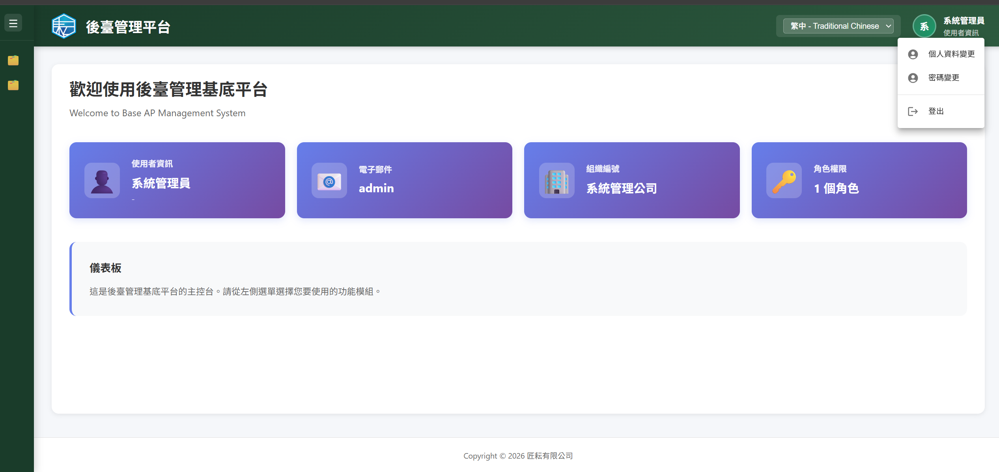

登入後預設進入儀表板頁面，顯示以下區塊：

| 區塊              | 說明                       |
| ----------------- | -------------------------- |
| 歡迎詞            | 歡迎使用者後臺管理基底平台 |
| 👤 使用者資訊卡片 | 顯示使用者名稱及職稱       |
| 📧 電子郵件卡片   | 顯示使用者電子郵件         |
| 🏢 組織編號卡片   | 顯示使用者所屬組織資訊     |
| 🔑 角色權限卡片   | 顯示使用者所屬系統角色     |
| 儀表板            | 儀表板說明                 |

**畫面上方導覽列（所有頁面共用）：**

| 位置      | 元素             | 操作                                                                         |
| --------- | ---------------- | ---------------------------------------------------------------------------- |
| ↖️ 左側 | 系統 Logo + 標題 | 點擊可回到儀表板首頁                                                         |
| ↗️ 中右 | 語系切換器       | 點擊切換系統介面語言                                                         |
| ↗️ 右側 | 使用者資訊       | 滑鼠移入自動浮出「**個人化功能**」選單（個人資料變更、密碼變更、登出） |

### 3.2 📢 系統通知

> 💡 **情境**：管理員發布了一則系統升級公告，登入後自動彈出提醒。

若有啟用中的系統通知，登入後會**自動彈出**通知視窗：

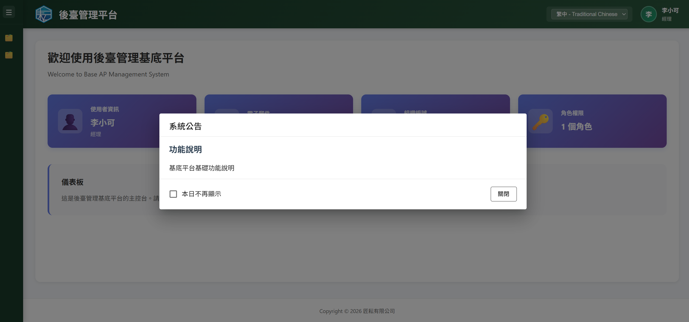

**操作方式：**

| 操作              | 說明                                        |
| ----------------- | ------------------------------------------- |
| 👁️ 閱讀         | 通知視窗顯示標題與 HTML 格式內容            |
| ⬅️ ➡️ 切換    | 多則通知時，點擊「上一則 / 下一則」按鈕瀏覽 |
| ☑️ 今日不再顯示 | 勾選後關閉，**當日內**不再彈出此通知  |
| ✖️ 關閉         | 直接關閉通知視窗                            |

### 3.3 📂 側邊欄選單

> 💡 **情境**：要從儀表板進入某個功能頁面，或是想快速切換不同功能。

左側為功能導覽選單，依據使用者角色權限**只顯示有權存取的功能**。

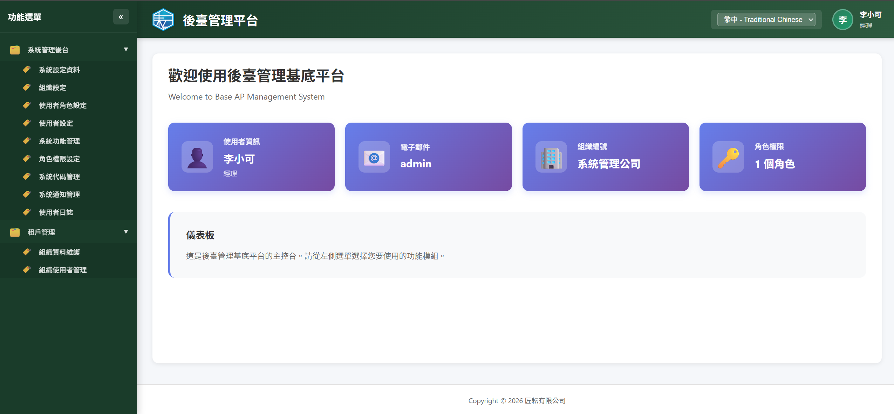

**操作方式：**

| 操作            |  圖示  | 說明                                    |
| --------------- | :-----: | --------------------------------------- |
| 展開/收合側邊欄 |   ☰   | 點擊左上角漢堡圖示，切換側邊欄寬版/窄版 |
| 展開節點        | 🗂️ ▶ | 點擊節點名稱，展開顯示子功能列表        |
| 收合節點        | 🗂️ ▼ | 再次點擊已展開的節點，收合子功能列表    |
| 進入功能        |  🏷️  | 點擊功能名稱，右側內容區載入該功能頁面  |
| 目前位置        |   🟢   | 目前所在的功能會以**高亮色**標示  |

> 💡 **窄版模式**：側邊欄收合後只顯示圖示，將滑鼠移到節點圖示上方會**懸浮彈出**子功能選單，點擊即可進入。

---

## 4. 個人設定

### 4.1 👤 個人資料

> 💡 **情境**：剛拿到帳號，想更新自己的名稱、部門、電話等聯絡資訊。

**路徑**：滑鼠移到右上角「使用者資訊」→ 個人化功能 → 「👤 個人資料變更」

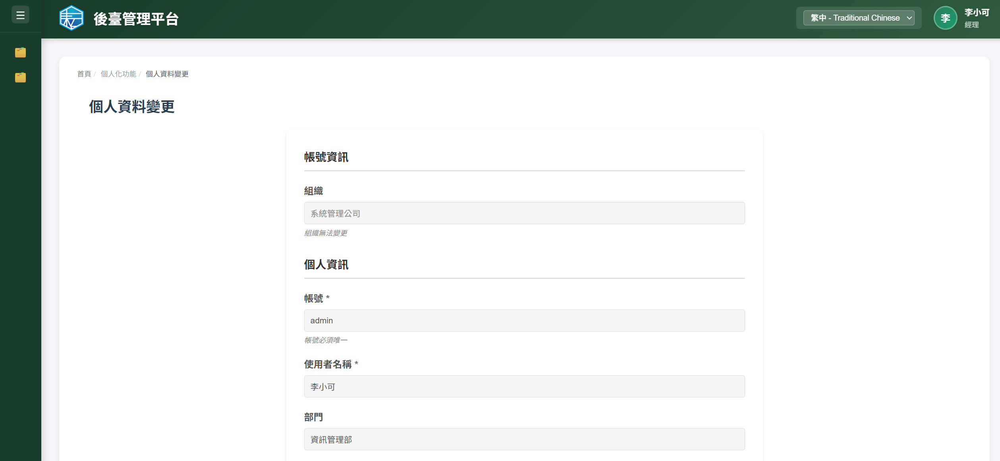

**操作步驟：**

1. 🖱️ 將滑鼠移到畫面右上角的「使用者資訊」區塊，自動浮出「個人化功能」選單，點擊「**個人資料變更**」
2. 📋 進入個人資料頁面，頁面分為兩個區塊：

**帳號資訊（Account Information）：**

| 欄位                        | 說明                 | 可否編輯          |
| --------------------------- | -------------------- | ----------------- |
| 🏢 Organization（所屬組織） | 顯示您所屬的組織名稱 | 🔒 僅讀（灰色底） |

**個人資訊（Personal Information）：**

| 欄位                      | 說明             | 可否編輯    |
| ------------------------- | ---------------- | ----------- |
| 📧 Account（帳號）        | 登入帳號，需唯一 | ✏️ 可編輯 |
| 👤 Username（使用者名稱） | 系統中顯示的名稱 | ✏️ 可編輯 |
| 🏛️ Department（部門）   | 所屬部門         | ✏️ 可編輯 |
| 💼 Job Title（職稱）      | 職務名稱         | ✏️ 可編輯 |
| 📞 Phone（電話）          | 聯絡電話         | ✏️ 可編輯 |

3. ✏️ 直接在欄位中修改內容
4. 💾 點擊頁面下方「**儲存**」按鈕
5. ✅ 出現「儲存成功」提示即完成

> ⚠️ **注意**：帳號（Account）修改後，下次登入需使用新帳號。請務必記住修改後的帳號。

### 4.2 🔒 變更密碼

> 💡 **情境**：首次登入系統後想修改預設密碼，或定期更新密碼確保帳號安全。

**路徑**：滑鼠移到右上角「使用者資訊」→ 個人化功能 → 「🔒 密碼變更」

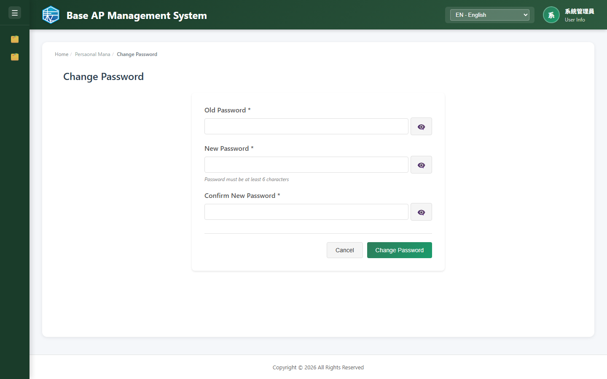

**操作步驟：**

| 步驟 | 欄位                               | 操作細節                              |
| :--: | ---------------------------------- | ------------------------------------- |
|  ①  | Old Password（舊密碼）             | 輸入目前使用的密碼                    |
|  ②  | New Password（新密碼）             | 輸入新密碼（**至少 6 個字元**） |
|  ③  | Confirm New Password（確認新密碼） | 再次輸入相同的新密碼                  |

然後：

4. 🖱️ 點擊「**Change Password**」（變更密碼）按鈕
5. ✅ 出現成功提示即完成

> 💡 **提示**：每個密碼欄位右側都有 👁️ 眼睛圖示，點擊可切換明碼/密碼顯示，方便確認輸入正確。
>
> ⚠️ **注意**：新密碼**不能**與舊密碼相同。如果不想變更，點擊「Cancel」取消即可返回。

---

## 5. 系統管理

> 🔐 以下功能需具備「系統管理」角色權限才能存取。在側邊欄的「🗂️ 系統管理後台」節點下。

### 5.1 ⚙️ 系統設定資料

> 💡 **情境**：系統剛上線，需要設定系統名稱、啟用語系、選擇登入頁風格。

**路徑**：系統管理後台 → 系統設定資料

系統唯一一筆設定資料，控制整個系統的基本設定。

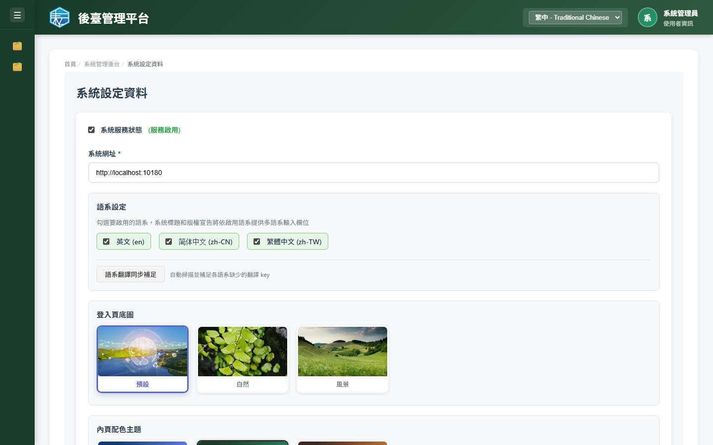

#### 📋 操作步驟：基本設定

1. 🖱️ 從側邊欄進入「系統管理後台 → 系統設定資料」
2. 📋 頁面顯示唯一一筆系統設定資料，所有欄位直接在頁面上編輯：

| 步驟 | 欄位            | 操作細節                                                                                 |
| :--: | --------------- | ---------------------------------------------------------------------------------------- |
|  ①  | ✅ 系統服務狀態 | 勾選 = 系統正常運作；**取消勾選 = 系統進入維護模式**（所有使用者將被擋在登入頁外） |
|  ②  | 🌐 系統網址     | 輸入系統的對外存取 URL（如 `http://your-domain.com`）                                  |
|  ③  | 🏢 所屬組織     | 從下拉選單選擇系統管理組織                                                               |
|  ④  | 📧 管理員信箱   | 輸入系統管理員 Email（維護模式時會顯示此信箱供使用者聯繫）                               |
|  ⑤  | 🕐 系統時區     | 選擇時區（預設 `Asia/Taipei`）                                                         |

#### 🌐 操作步驟：語系設定

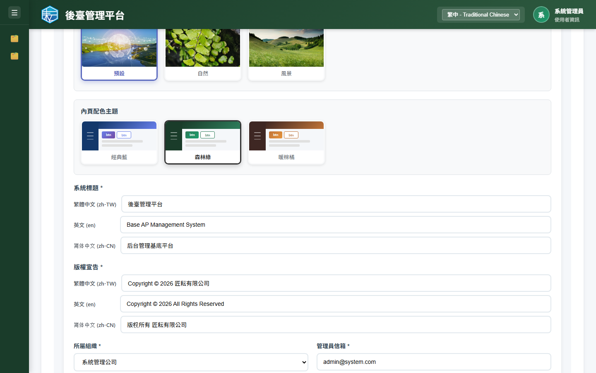

1. 📋 在語系設定區塊，看到所有已建立的語系（如 `zh-TW`、`en`）
2. ☑️ **勾選**要啟用的語系（至少需勾選一個）
3. 🔤 勾選多個語系後，下方的「系統標題」和「版權宣告」會**自動出現對應語系的輸入欄位**
4. ✏️ 在每個語系的輸入框中填入對應語言的標題/版權文字
5. 🔄 （選用）點擊「**語系翻譯同步補足**」按鈕 → 系統自動掃描所有語系檔案，將缺少的翻譯 key 以預設語系值補齊

> 💡 **什麼時候要按「語系翻譯同步補足」？** 當您新增了一個語系、或發現某些介面文字沒有翻譯時，按此按鈕即可自動補齊。

#### 🖼️ 操作步驟：登入頁底圖 & 🎨 配色主題

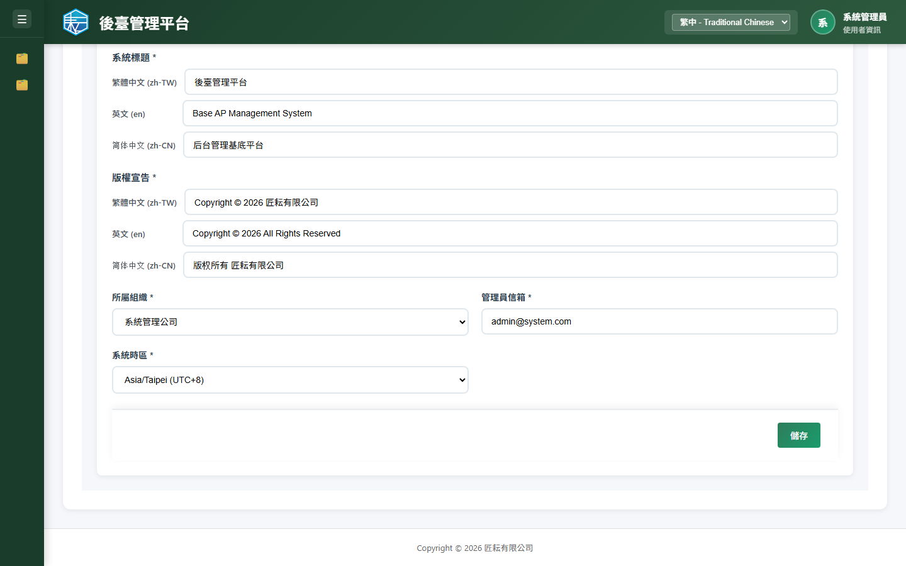

**選擇登入頁底圖：**

1. 📋 在「登入頁底圖」區塊看到三張縮圖
2. 🖱️ 點擊想要的底圖縮圖即可選取（選中的縮圖會有框線標示）

| 選項      | 說明             |
| --------- | ---------------- |
| 🔲 預設   | 系統預設背景圖   |
| 🌿 自然   | 自然植物風格背景 |
| 🏔️ 風景 | 山丘草原風景背景 |

**選擇內頁配色主題：**

1. 📋 在「內頁配色主題」區塊看到三組迷你預覽圖
2. 🖱️ 點擊想要的配色預覽即可選取

| 選項      | 側邊欄 | 強調色     | 影響範圍                       |
| --------- | ------ | ---------- | ------------------------------ |
| 💙 經典藍 | 深藍色 | 紫藍色漸層 | 側邊欄、標題列、按鈕、焦點狀態 |
| 💚 森林綠 | 深綠色 | 翠綠色漸層 | 同上                           |
| 🧡 暖棕橘 | 深棕色 | 暖橘色漸層 | 同上                           |

#### 💾 儲存設定

1. 📝 確認所有設定正確（系統標題、版權宣告每個語系都填寫）
2. 💾 點擊頁面下方「**儲存**」按鈕
3. ✅ 出現成功提示後，以下項目**立即生效**：
   - 🎨 側邊欄與標題列的配色主題
   - 📝 上方標題列的系統名稱
   - 🌐 語系切換器的可選語系
   - ©️ 頁尾版權宣告文字

> ⚠️ **注意**：如果取消「系統服務狀態」勾選並儲存，系統會**立即進入維護模式**，所有使用者（包括您自己刷新頁面後）都會看到維護中頁面。

---

### 5.2 📂 系統功能管理

> 💡 **情境**：要新增一個應用功能到系統選單，讓使用者可以從側邊欄存取。

**路徑**：系統管理後台 → 系統功能管理

管理系統的選單結構與功能定義，控制側邊欄的導覽選單。

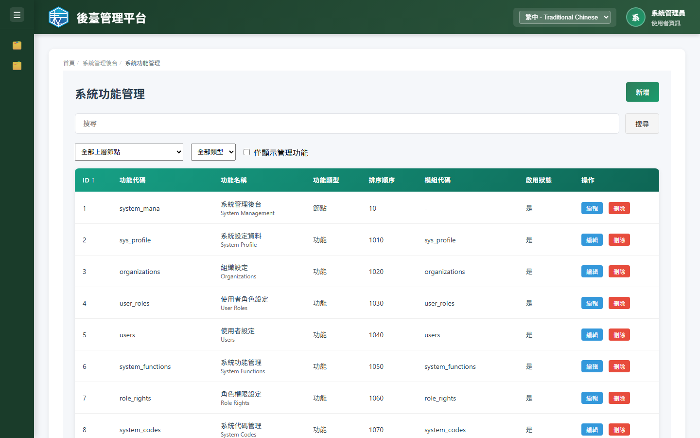

#### 🏷️ 功能類型

| 類型 | 圖示 | 說明                          |
| ---- | :--: | ----------------------------- |
| 節點 | 🗂️ | 選單資料夾/分類，可包含子功能 |
| 功能 | 🏷️ | 實際頁面功能                  |

#### 📋 欄位說明

| 欄位          | 說明                                                   |
| ------------- | ------------------------------------------------------ |
| 🔤 功能代碼   | 唯一識別碼（如 `sys_profile`）                       |
| 🔗 上層功能   | 父節點 ID（0 = 根層級）                                |
| 🌐 功能名稱   | 多語系名稱（每個啟用語系各一個輸入框）                 |
| 📁 功能類型   | 節點 / 功能                                            |
| 🔢 排序       | 顯示順序（數字越小越前面，`< 10` 為隱藏功能）        |
| 🎨 圖示       | Emoji 圖示（顯示於選單）                               |
| 📦 模組代碼   | 前端路由路徑（功能類型時必填）                         |
| 🔐 模組項目   | 支援的操作項目（Create/Read/Update/Delete/Print/File） |
| 📝 說明       | 功能描述                                               |
| ⚙️ 系統管理 | 標記為系統管理功能                                     |
| ✅ 啟用       | 啟用/停用                                              |

#### ✏️ 新增/編輯表單

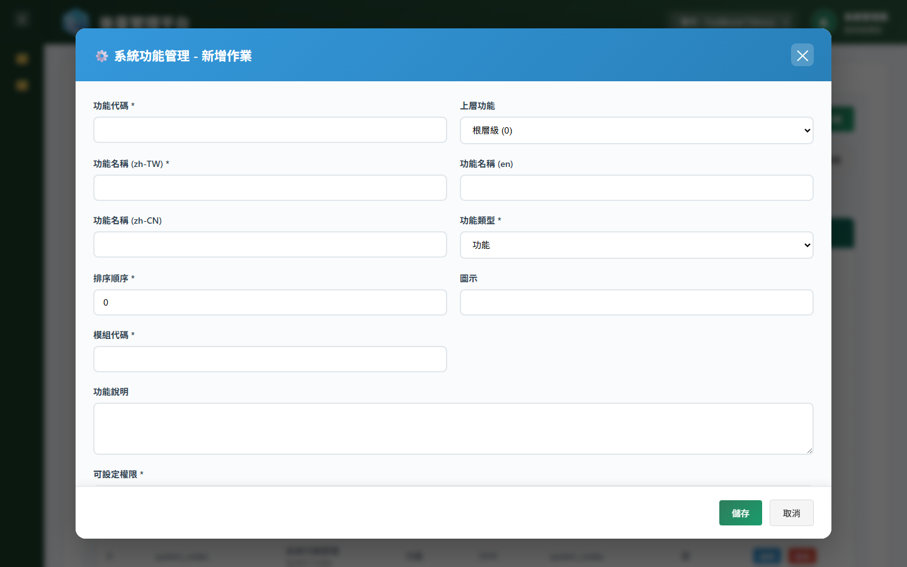

> 📌 **重要**：當功能類型選擇「節點」時，模組代碼和模組項目會自動停用；選擇「功能」時，這兩個欄位為必填。

#### 🔍 操作：搜尋與篩選

1. 🖱️ 在列表上方的搜尋區域可以進行以下操作：
   - **搜尋欄位**：輸入功能代碼或名稱關鍵字，按 🔍 搜尋
   - **上層功能**篩選：下拉選擇特定節點，只顯示該節點下的子功能
   - **功能類型**篩選：選擇「節點」或「功能」
   - **是否系統管理**篩選：篩選系統管理功能
2. ↕️ 點擊表頭欄位名稱可切換排序方式（ID / 排序值）

#### ➕ 操作：新增功能

> 💡 **情境**：要新增一個應用功能「公告管理」到系統選單。

1. 🖱️ 點擊列表右上角的「**➕ 新增**」按鈕
2. 📋 彈出新增表單 Modal，依序填入：

| 步驟 | 欄位            | 操作細節                                                                          |
| :--: | --------------- | --------------------------------------------------------------------------------- |
|  ①  | 功能代碼        | 輸入唯一識別碼，如 `bulletins`（不可與現有代碼重複）                            |
|  ②  | 上層功能        | 從下拉選單選擇父節點（選「0」= 根層級）                                           |
|  ③  | 功能名稱        | **每個啟用語系各填一個輸入框**，如 zh-TW 填「公告管理」、en 填「Bulletins」 |
|  ④  | 功能類型        | 選擇「**節點**」（選單分類）或「**功能**」（實際頁面）                |
|  ⑤  | 排序            | 輸入數字（越小越前面，`< 10` 為隱藏功能不顯示在選單）                           |
|  ⑥  | 圖示            | 輸入 Emoji（如 `📋`）                                                           |
|  ⑦  | 模組代碼        | 選「功能」時**必填**，輸入前端路由路徑如 `bulletins`                      |
|  ⑧  | 模組項目        | 選「功能」時必填，☑️ 勾選支援的權限項目（Create/Read/Update/Delete/Print/File） |
|  ⑨  | 說明            | （選填）輸入功能描述                                                              |
|  ⑩  | 系統管理 / 啟用 | 視需要勾選                                                                        |

3. 💾 點擊「**儲存**」按鈕
4. ✅ Modal 關閉，列表自動刷新顯示新功能

> 📌 **重要**：選擇「節點」類型時，模組代碼和模組項目會**自動灰掉停用**（節點只是選單分類，不對應實際頁面）。

#### ✏️ 操作：編輯功能

1. 🖱️ 在列表中找到要修改的功能，點擊該列右側的「✏️ 編輯」按鈕（藍色）
2. 📋 彈出編輯表單 Modal，欄位已預填現有資料
3. ✏️ 修改需要變更的欄位
4. 💾 點擊「**儲存**」按鈕
5. ✅ Modal 關閉，列表自動刷新

#### 👁️ 操作：檢視功能

1. 🖱️ 點擊該列右側的「👁️ 檢視」按鈕（綠色）
2. 📋 彈出 Modal，所有欄位以**唯讀模式**顯示（灰色背景，無法編輯）
3. 🖱️ 點擊「取消」或 ✖️ 關閉

#### 🗑️ 操作：刪除功能

1. 🖱️ 點擊該列右側的「🗑️ 刪除」按鈕（紅色）
2. ⚠️ 系統彈出確認對話框：「確定要刪除嗎？」
3. 🖱️ 點擊「確定」執行刪除

> ⚠️ **無法刪除的情況**：
>
> - 該功能下**還有子功能**（需先刪除或搬移子功能）
> - 該功能已被**角色權限設定引用**（需先到角色權限設定移除引用）
> - 刪除失敗時系統會顯示錯誤原因

---

### 5.3 🏷️ 系統代碼管理

> 💡 **情境**：需要維護下拉選單中的選項，例如組織類型（機關/公司/個人）。

**路徑**：系統管理後台 → 系統代碼管理

管理系統使用的各類代碼對照表（如狀態碼、類別碼等）。

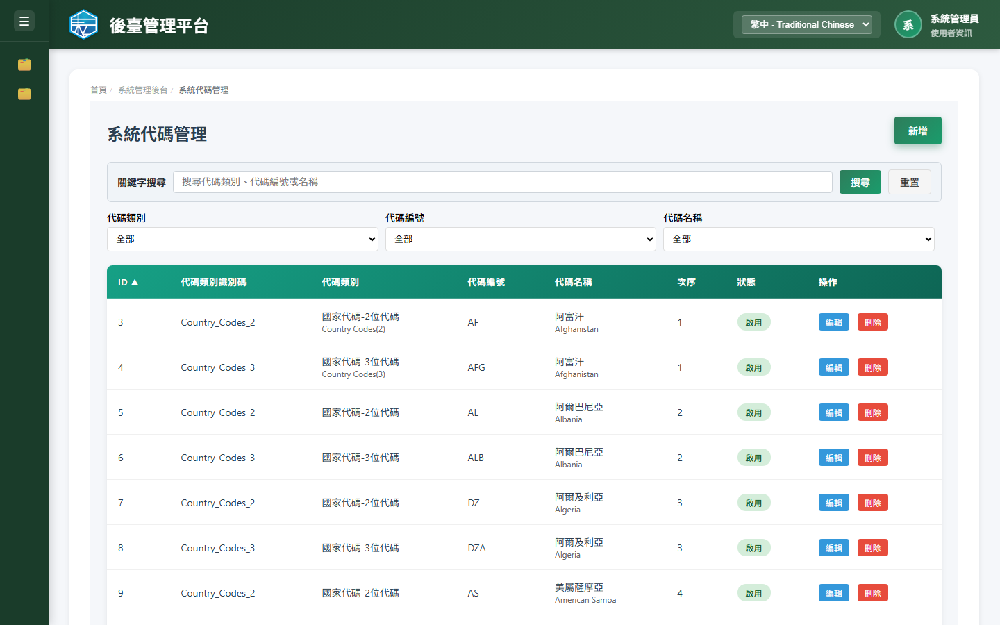

#### 📋 欄位說明

| 欄位            | 說明                                      |
| --------------- | ----------------------------------------- |
| 🏷️ 代碼類型   | 分類識別碼（如 `status`、`org_type`） |
| 🌐 代碼類型名稱 | 多語系類型名稱                            |
| 🔤 代碼         | 代碼值                                    |
| 🌐 代碼名稱     | 多語系代碼名稱                            |
| 🔢 排序         | 顯示順序                                  |
| 📝 備註 1~5     | 可自訂用途的備註欄位                      |
| ✅ 啟用         | 啟用/停用                                 |

#### ➕ 操作：新增代碼

> 💡 **情境**：要新增一個「組織類型」的代碼選項，例如新增「基金會」類型。

1. 🖱️ 點擊列表右上角的「**➕ 新增**」按鈕
2. 📋 彈出新增表單 Modal，依序填入：

| 步驟 | 欄位         | 操作細節                                                                   |
| :--: | ------------ | -------------------------------------------------------------------------- |
|  ①  | 代碼類型     | 輸入分類識別碼（如 `org_type`）— 若是現有類型的新選項，填入同一個類型碼 |
|  ②  | 代碼類型名稱 | 多語系輸入（zh-TW: 「組織類型」、en: 「Organization Type」）               |
|  ③  | 代碼         | 輸入代碼值（如 `foundation`）                                            |
|  ④  | 代碼名稱     | 多語系輸入（zh-TW: 「基金會」、en: 「Foundation」）                        |
|  ⑤  | 排序         | 輸入數字控制此選項在下拉選單中的顯示順序                                   |
|  ⑥  | 備註 1~5     | （選填）可自訂用途的附加資訊                                               |
|  ⑦  | 啟用         | 勾選啟用此代碼                                                             |

3. 💾 點擊「**儲存**」
4. ✅ 新代碼出現在列表中

#### 🔍 操作：搜尋與篩選

| 操作            | 方式                                                   |
| --------------- | ------------------------------------------------------ |
| 🔍 關鍵字搜尋   | 在搜尋框輸入文字，同時搜尋代碼類型、代碼名稱等多個欄位 |
| 🔽 代碼類型篩選 | 從下拉選單選擇特定代碼類型                             |
| 🔽 代碼編號篩選 | 篩選特定代碼值                                         |
| 🔽 代碼名稱篩選 | 篩選特定代碼名稱                                       |
| ↕️ 排序       | 點擊表頭切換排序（ID / 代碼類型 / 排序值）             |
| 🔄 重置篩選     | 點擊「重置」按鈕一鍵清除所有篩選條件                   |

#### ✏️ 編輯 / 👁️ 檢視 / 🗑️ 刪除

操作方式同 §5.2 系統功能管理（點擊列表右側對應的藍色/綠色/紅色按鈕）。

---

### 5.4 👥 使用者角色管理

> 💡 **情境**：新專案上線，需要建立一個「專案管理員」角色，後續再指派權限和使用者。

**路徑**：系統管理後台 → 使用者角色設定

管理系統中的角色定義。角色用於歸類使用者並指派權限。

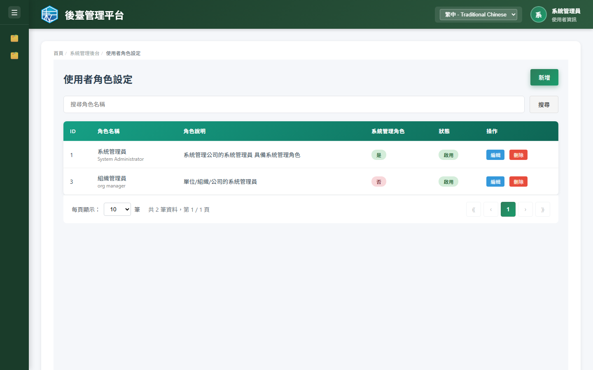

#### ➕ 操作：新增角色

1. 🖱️ 點擊列表右上角的「**➕ 新增**」按鈕
2. 📋 彈出新增表單 Modal，依序填入：

| 步驟 | 欄位              | 操作細節                                                                      |
| :--: | ----------------- | ----------------------------------------------------------------------------- |
|  ①  | 🌐 角色名稱       | 每個啟用語系各填一個名稱（如 zh-TW: 「專案管理員」、en: 「Project Manager」） |
|  ②  | 📝 說明           | 輸入角色描述（如「負責專案進度管理與報告」）                                  |
|  ③  | ⚙️ 系統管理角色 | 勾選 = 此角色可看到「系統管理後台」選單下的功能                               |
|  ④  | ✅ 啟用           | 勾選啟用此角色                                                                |

3. 💾 點擊「**儲存**」
4. ✅ 新角色出現在列表中

> 💡 **下一步**：角色建立後，還需要到「🔐 角色權限設定」（§5.5）為此角色勾選可存取的功能權限。

#### 🔍 搜尋 / ✏️ 編輯 / 👁️ 檢視 / 🗑️ 刪除

- 🔍 在搜尋框輸入角色名稱關鍵字即可篩選
- ✏️ / 👁️ / 🗑️ 操作方式同 §5.2

---

### 5.5 🔐 角色權限設定

> 💡 **情境**：建立好角色後，要決定這個角色可以做哪些事——哪些功能可以看、可以改、可以刪。

**路徑**：系統管理後台 → 角色權限設定

為角色指派各功能的操作權限。

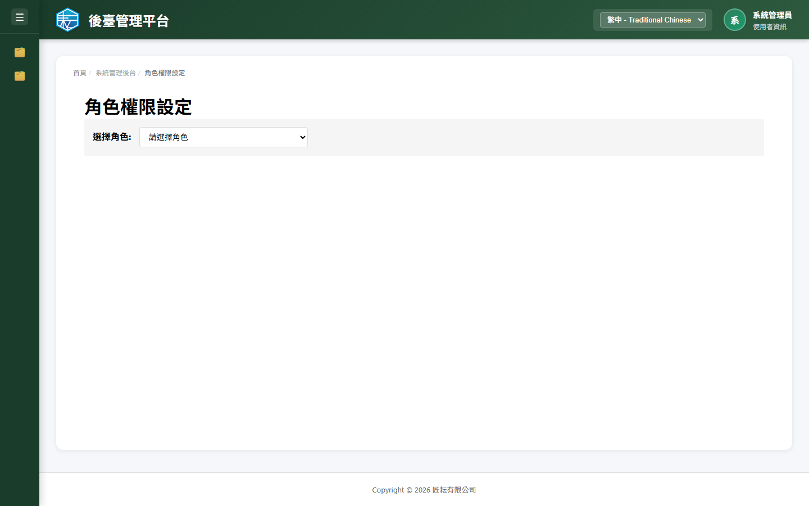

#### 📝 操作步驟

**Step 1 — 選擇角色：**

1. 🖱️ 在頁面上方的「**Select Role**」下拉選單，選擇要設定權限的角色
2. 📋 系統載入該角色的現有權限狀態，以樹狀結構顯示所有功能

**Step 2 — 勾選權限：**

每個功能右側有 6 個 checkbox，對應不同的操作權限：

| 權限   | 圖示 | 說明        | 典型用途           |
| ------ | :--: | ----------- | ------------------ |
| Create |  ➕  | 可新增資料  | 表單的「新增」按鈕 |
| Read   | 👁️ | 可檢視資料  | 列表頁面的存取權   |
| Update | ✏️ | 可編輯資料  | 表單的「編輯」按鈕 |
| Delete | 🗑️ | 可刪除資料  | 「刪除」按鈕       |
| Print  | 🖨️ | 可列印/匯出 | 匯出 / 列印功能    |
| File   |  📎  | 可管理附件  | 檔案上傳 / 下載    |

操作方式：

- ☑️ **逐一勾選**：點擊各功能的 checkbox 個別設定
- ⚡ **批次操作**：節點層級提供「**全選**」和「**全部取消**」按鈕，一次勾選/取消該節點下所有功能的所有權限

**Step 3 — 儲存：**

3. 💾 完成所有勾選後，點擊「**儲存**」按鈕
4. ✅ 出現成功提示，權限**立即生效**（該角色的使用者下次操作時即套用新權限）

> ⚠️ **注意**：系統保留功能（ID 1~5）的權限為固定值，不可修改（checkbox 為灰色停用狀態）。
>
> 💡 **實用技巧**：如果要快速設定一個「只能瀏覽不能修改」的角色，可以先在每個節點點擊「全選」，然後手動取消 Create / Update / Delete 的勾選，只保留 Read。

---

### 5.6 🏢 組織單位管理

> 💡 **情境**：新客戶要使用系統，需要先建立他們的組織資料。

**路徑**：系統管理後台 → 組織設定

管理系統中的所有組織（公司/機關/個人）。

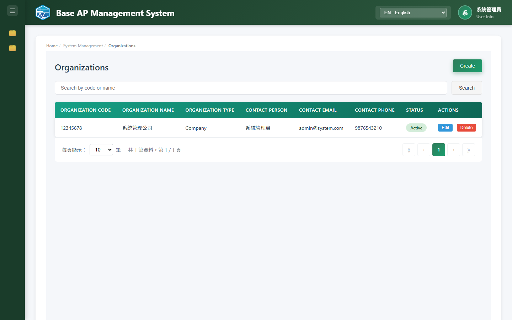

#### 📋 欄位說明

| 欄位              | 說明                               |
| ----------------- | ---------------------------------- |
| 🔤 組織代碼       | 唯一識別碼                         |
| 🏢 組織名稱       | 組織全名                           |
| 📁 組織類型       | 機關 / 公司 / 個人                 |
| 👤 聯絡人         | 主要聯絡人                         |
| 📧 聯絡信箱       | Email                              |
| 📞 聯絡電話       | 電話                               |
| 📍 地址           | 地址（選填）                       |
| 📝 備註           | 備註（選填）                       |
| ⚙️ 系統管理公司 | 標記為系統管理組織（僅系統可設定） |
| ✅ 啟用           | 啟用/停用                          |

#### ➕ 操作：新增組織

> 💡 **情境**：新客戶簽約，需要在系統中建立他們的公司資料。

1. 🖱️ 點擊列表右上角「**➕ 新增**」按鈕
2. 📋 彈出新增表單 Modal，依序填入：

| 步驟 | 欄位                        | 操作細節                                  |
| :--: | --------------------------- | ----------------------------------------- |
|  ①  | 🔤 組織代碼                 | 輸入唯一識別碼（如統一編號 `12345678`） |
|  ②  | 🏢 組織名稱                 | 輸入組織全名                              |
|  ③  | 📁 組織類型                 | 從下拉選單選擇（機關 / 公司 / 個人）      |
|  ④  | 👤 聯絡人                   | 輸入主要聯絡人姓名                        |
|  ⑤  | 📧 聯絡信箱                 | 輸入聯絡人 Email                          |
|  ⑥  | 📞 聯絡電話                 | 輸入聯絡電話                              |
|  ⑦  | 📍 地址 / 📞 總機 / 📝 備註 | （選填）                                  |
|  ⑧  | ✅ 啟用                     | 勾選啟用此組織                            |

3. 💾 點擊「**儲存**」
4. ✅ 新組織出現在列表中

> 💡 **下一步**：組織建立後，可以到「👤 使用者管理」（§5.7）為此組織新增使用者帳號。

#### 🔍 搜尋 / ✏️ 編輯 / 👁️ 檢視 / 🗑️ 刪除

- 🔍 在搜尋框輸入組織名稱或代碼即可篩選
- ✏️ / 👁️ / 🗑️ 操作方式同 §5.2
- 📄 **分頁**：列表下方可切換每頁顯示筆數（5 / 10 / 20 / 50 / 100）

---

### 5.7 👤 使用者管理

> 💡 **情境**：新同事到任，需要開通帳號並指派適當角色。

**路徑**：系統管理後台 → 使用者設定

管理系統中的所有使用者帳號。

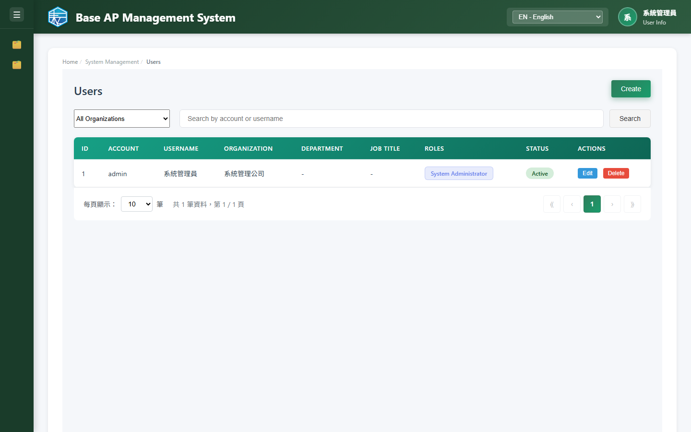

#### 📋 欄位說明

| 欄位          | 說明                                 |
| ------------- | ------------------------------------ |
| 🏢 所屬組織   | 使用者所屬組織                       |
| 📧 帳號       | 登入帳號（Email 格式，須唯一）       |
| 👤 使用者名稱 | 顯示名稱                             |
| 🔑 密碼       | 新增時必填，編輯時選填（留空不更改） |
| 🏛️ 部門     | 所屬部門（選填）                     |
| 💼 職稱       | 職務名稱（選填）                     |
| 📞 電話       | 聯絡電話（選填）                     |
| 🎭 角色       | 指派角色（可多選）                   |
| ✅ 啟用       | 啟用/停用                            |

#### ➕ 操作：新增使用者（開通帳號）

> 💡 **情境**：新同事到任，需要為他開通系統帳號並指派角色。

1. 🖱️ 點擊列表右上角「**➕ 新增**」按鈕
2. 📋 彈出新增表單 Modal，依序填入：

| 步驟 | 欄位                          | 操作細節                                                                  |
| :--: | ----------------------------- | ------------------------------------------------------------------------- |
|  ①  | 🏢 所屬組織                   | 從下拉選單選擇使用者所屬的組織                                            |
|  ②  | 📧 帳號                       | 輸入登入帳號（須唯一，不可與現有帳號重複）                                |
|  ③  | 👤 使用者名稱                 | 輸入顯示名稱（如「王小明」）                                              |
|  ④  | 🔑 密碼                       | 輸入初始密碼（新增時**必填**）                                      |
|  ⑤  | 🏛️ 部門 / 💼 職稱 / 📞 電話 | （選填）輸入部門、職稱、電話                                              |
|  ⑥  | 🎭 角色                       | ☑️ 勾選要指派的角色（**可多選**），勾選後使用者即擁有該角色的權限 |
|  ⑦  | ✅ 啟用                       | 勾選啟用此帳號                                                            |

3. 💾 點擊「**儲存**」
4. ✅ 新使用者出現在列表中
5. 📧 **通知新使用者**他的帳號和初始密碼，請他首次登入後變更密碼

> 💡 **完整開通流程**：
>
> ```
> ➕ 新增使用者 → ✏️ 填寫基本資料 → 🎭 勾選角色 → 💾 儲存 → 📧 通知帳號密碼
> ```

#### 🔍 操作：搜尋與篩選

| 操作        | 方式                                                |
| ----------- | --------------------------------------------------- |
| 🏢 組織篩選 | 左上方的「All Organizations」下拉選單，選擇特定組織 |
| 🔍 搜尋     | 在搜尋框輸入帳號或名稱關鍵字，點擊 🔍 搜尋          |

#### ✏️ 操作：編輯使用者

1. 🖱️ 點擊該列右側的「✏️ 編輯」按鈕
2. 📋 彈出編輯表單，**密碼欄位可留空**（留空 = 不變更密碼）
3. ✏️ 修改需要變更的欄位（如調整部門、更換角色等）
4. 💾 點擊「**儲存**」

> 💡 **重置密碼**：編輯使用者時，在密碼欄位輸入新密碼即可重置。

#### 📄 分頁

列表下方可切換每頁顯示筆數（5 / 10 / 20 / 50 / 100），使用 ⬅️ ➡️ 按鈕翻頁。

---

### 5.8 📢 系統通知管理

> 💡 **情境**：系統將進行升級維護，需要提前通知所有使用者。

**路徑**：系統管理後台 → 系統通知管理

管理系統公告通知，使用者登入後會依設定顯示通知。

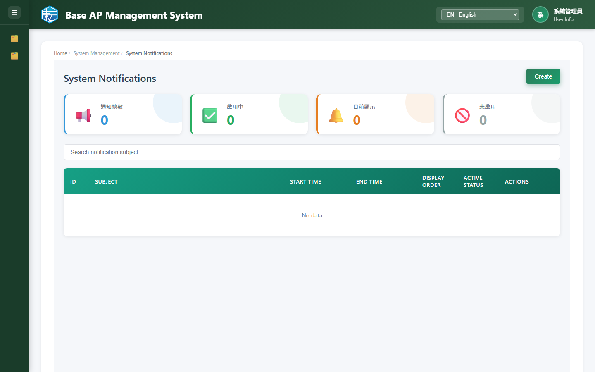

#### 📋 欄位說明

| 欄位        | 說明                 |
| ----------- | -------------------- |
| 🌐 通知標題 | 多語系通知標題       |
| 📝 通知內容 | 多語系 HTML 格式內容 |
| 📅 開始時間 | 通知生效時間         |
| 📅 結束時間 | 通知失效時間         |
| 🔢 排序     | 顯示順序             |
| ✅ 啟用     | 啟用/停用            |

#### 📊 統計卡片

頁面上方顯示四張統計卡片：

| 卡片        | 說明                     |
| ----------- | ------------------------ |
| 📋 通知總數 | 所有通知筆數             |
| 🟢 啟用中   | is_active = true 的筆數  |
| ⏰ 生效中   | 在有效日期範圍內的筆數   |
| 🔴 停用中   | is_active = false 的筆數 |

#### ➕ 操作：新增通知

> 💡 **情境**：下週系統要升級維護，需要提前通知所有使用者。

1. 🖱️ 點擊列表右上角「**➕ 新增**」按鈕
2. 📋 彈出新增表單 Modal，依序填入：

| 步驟 | 欄位        | 操作細節                                                       |
| :--: | ----------- | -------------------------------------------------------------- |
|  ①  | 🌐 通知標題 | 每個啟用語系各填一個標題（如 zh-TW: 「系統升級通知」）         |
|  ②  | 📝 通知內容 | 每個啟用語系各填內容（支援 HTML 格式）                         |
|  ③  | 📅 開始時間 | 點擊日期選擇器，選擇通知**生效**的日期時間               |
|  ④  | 📅 結束時間 | 選擇通知**失效**的日期時間（**必須晚於開始時間**） |
|  ⑤  | 🔢 排序     | 輸入數字（多則通知時控制彈出順序）                             |
|  ⑥  | ✅ 啟用     | 勾選啟用此通知                                                 |

3. 💾 點擊「**儲存**」
4. ✅ 通知出現在列表中，頁面上方的統計卡片自動更新數字

> ⚠️ **通知何時會彈出？** 使用者在通知的「開始～結束時間」範圍內登入系統時，會自動彈出顯示。

#### 🔍 搜尋 / ✏️ 編輯 / 🗑️ 刪除

- 🔍 在搜尋框輸入通知標題關鍵字即可篩選
- ✏️ / 👁️ / 🗑️ 操作方式同 §5.2
- 📄 **分頁**：每頁 10 / 25 / 50 / 100 筆

---

### 5.9 📋 使用者日誌

> 💡 **情境**：某筆資料被意外修改了，需要查出是誰在什麼時候改的，改了什麼內容。

**路徑**：系統管理後台 → 使用者日誌

查看系統操作稽核紀錄。所有使用者的操作行為均自動記錄。

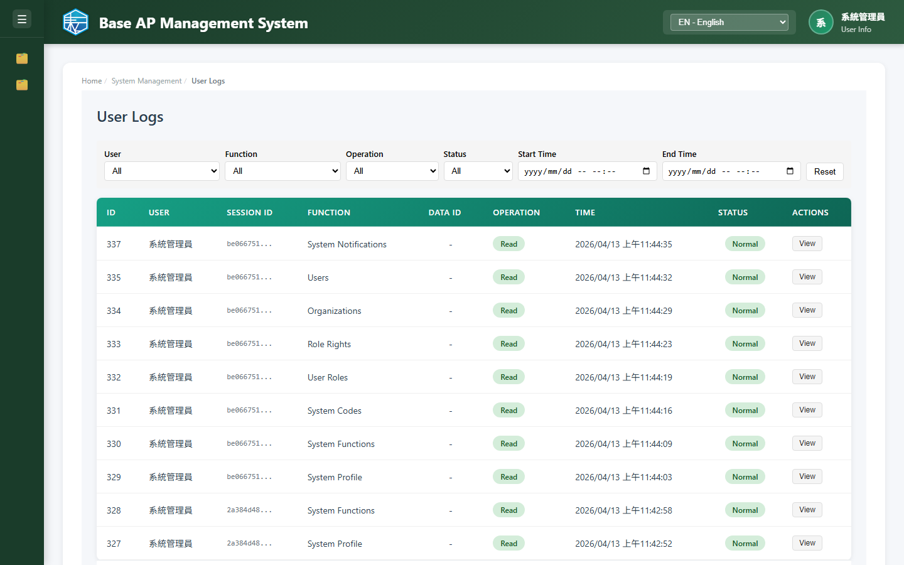

#### 🔍 篩選條件

| 篩選          | 說明                                                          |
| ------------- | ------------------------------------------------------------- |
| 👤 使用者     | 篩選特定使用者                                                |
| 📂 功能       | 篩選特定系統功能                                              |
| 🏷️ 操作類型 | View / Create / Read / Update / Delete / Print / File / Login |
| 📊 狀態       | ✅ 正常 / ❌ 錯誤                                             |
| 📅 開始日期   | 查詢起始時間                                                  |
| 📅 結束日期   | 查詢結束時間                                                  |

#### 🔍 操作：篩選查詢

> 💡 **情境**：某筆組織資料被改了，想查出是誰、什麼時候改的。

1. 📋 在頁面上方的篩選區域設定條件：

| 步驟 | 篩選條件      | 操作細節                                        |
| :--: | ------------- | ----------------------------------------------- |
|  ①  | 👤 使用者     | 從下拉選單選擇特定使用者（或留空 = 全部使用者） |
|  ②  | 📂 功能       | 從下拉選單選擇特定功能（如「Organizations」）   |
|  ③  | 🏷️ 操作類型 | 選擇操作類型（如「Update」= 只看修改記錄）      |
|  ④  | 📊 狀態       | 選擇「正常」或「錯誤」                          |
|  ⑤  | 📅 日期範圍   | 設定開始日期和結束日期                          |

2. 🖱️ 點擊「**搜尋**」按鈕執行查詢
3. 📋 列表顯示符合條件的日誌記錄

> 💡 **快速清除**：點擊「🔄 重置」按鈕可一鍵清除所有篩選條件回到預設狀態。

#### 👁️ 操作：檢視日誌詳情

1. 🖱️ 點擊列表中某一列的「👁️ 檢視」按鈕（或直接點擊該列）
2. 📋 彈出詳細資訊 Modal，包含以下區塊：

| 區塊                      | 說明                                                        | 何時出現                  |
| ------------------------- | ----------------------------------------------------------- | ------------------------- |
| ℹ️ 基本資訊             | ID、時間、使用者、功能、Session ID、資料 ID、操作類型、狀態 | 所有日誌                  |
| ❌ 錯誤訊息               | 錯誤詳情文字                                                | 僅操作失敗時              |
| 👁️ 查看資料 (look_data) | 讀取/刪除操作時記錄的原始資料（JSON 格式）                  | View / Read / Delete 操作 |
| 🔄 變更資料 (change_data) | 修改前後的資料比對，**差異欄位以高亮色標示**          | Update 操作               |

3. 🖱️ 點擊 ✖️ 或「關閉」離開詳情

> 💡 **查看變更差異**：在 Update 日誌的「變更資料」區塊，系統會自動比較修改前（look_data）和修改後（change_data）的每個欄位，**有變更的欄位會以醒目顏色標示**，方便快速辨識改了什麼。

#### 📄 分頁

列表下方可切換每頁顯示筆數（10 / 25 / 50 / 100），使用 ⬅️ ➡️ 按鈕翻頁。

> 🔒 **注意**：日誌為**唯讀**，不可修改或刪除。這確保了稽核軌跡的完整性與合規要求。

---

## 6. 租戶管理

> 💡 **情境**：您是某組織的管理者（非系統管理員），需要管理自己組織的資料和成員。

租戶管理功能提供給非系統管理組織的管理者使用，可管理自身組織的資料與成員。

### 6.1 🏢 組織資料維護

**路徑**：租戶管理 → 組織資料維護

檢視與編輯自身組織的基本資料。

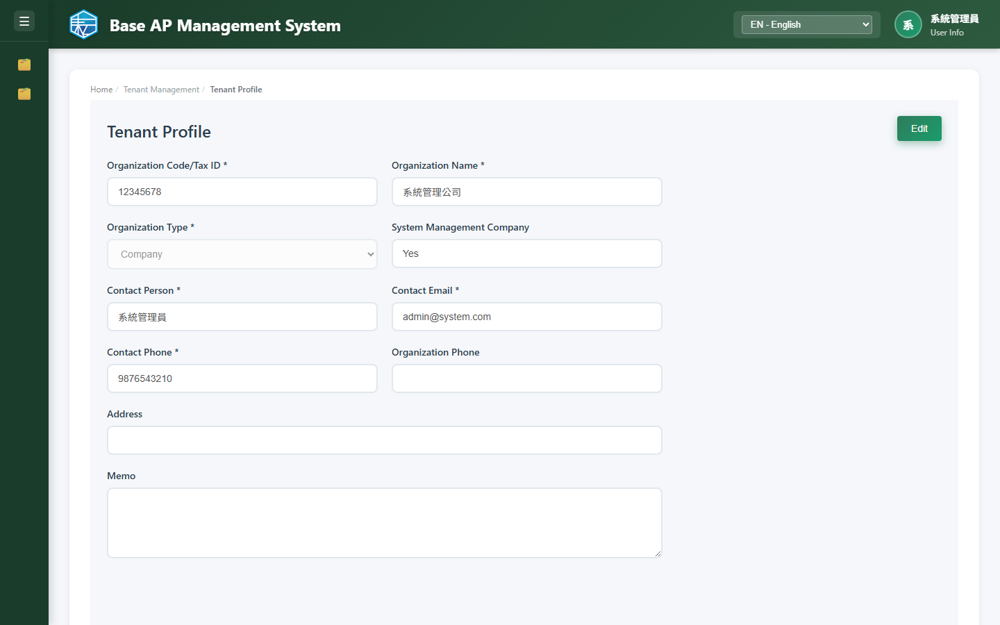

#### 📋 操作步驟：檢視與編輯

1. 🖱️ 從側邊欄進入「租戶管理 → 組織資料維護」
2. 📋 頁面直接顯示您所屬組織的資料表單，欄位包含：

| 欄位                                  | 說明                                      | 可否編輯      |
| ------------------------------------- | ----------------------------------------- | ------------- |
| 🔤 Organization Code/Tax ID           | 組織代碼（統一編號）                      | ✏️ 可編輯   |
| 🏢 Organization Name                  | 組織名稱                                  | ✏️ 可編輯   |
| 📁 Organization Type                  | 組織類型（Company / Agency / Individual） | ✏️ 下拉選擇 |
| ⚙️ System Management Company        | 是否為系統管理組織                        | 🔒 僅讀       |
| 👤 Contact Person                     | 聯絡人                                    | ✏️ 可編輯   |
| 📧 Contact Email                      | 聯絡信箱                                  | ✏️ 可編輯   |
| 📞 Contact Phone / Organization Phone | 聯絡電話 / 總機                           | ✏️ 可編輯   |
| 📍 Address                            | 地址                                      | ✏️ 可編輯   |
| 📝 Memo                               | 備註                                      | ✏️ 可編輯   |

3. 🖱️ 點擊右上角「**✏️ Edit**」按鈕進入編輯模式（如果頁面初始為唯讀狀態）
4. ✏️ 修改需要變更的欄位
5. 💾 點擊「**儲存**」按鈕
6. ✅ 出現成功提示即完成

> 🔒 **注意**：「System Management Company」欄位為系統自動標記，租戶無法自行變更。

### 6.2 👥 組織使用者管理

**路徑**：租戶管理 → 組織使用者管理

管理自身組織的成員帳號。

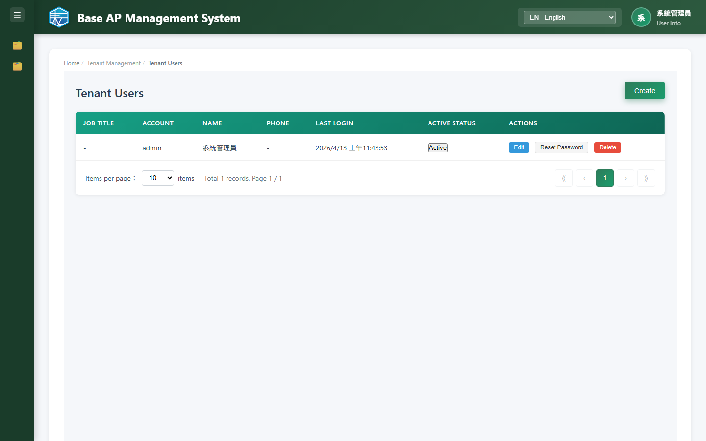

#### ➕ 操作：新增組織成員

> 💡 **情境**：部門有新同事加入，需要為他開通系統帳號。

1. 🖱️ 點擊「**➕ 新增**」按鈕
2. 📋 彈出新增表單 Modal，填入帳號、名稱、密碼等基本資料
3. 🎭 在角色區塊勾選要指派的角色（**僅顯示非系統管理角色**）
4. 💾 點擊「**儲存**」

#### 🛠️ 其他操作

| 操作          | 步驟                                        |
| ------------- | ------------------------------------------- |
| ✏️ 編輯成員 | 點擊 ✏️ 按鈕 → 修改資料 → 💾 儲存       |
| 🗑️ 刪除成員 | 點擊 🗑️ 按鈕 → ⚠️ 確認刪除             |
| 🔑 重置密碼   | 編輯成員時在密碼欄輸入新密碼 → 💾 儲存     |
| 🎭 角色指派   | 編輯成員時勾選/取消角色 checkbox → 💾 儲存 |
| 🔄 啟用/停用  | 編輯成員時切換「啟用」checkbox → 💾 儲存   |

> 💡 列表中可看到每位成員的最後登入時間與 IP，方便管理者掌握帳號使用狀態。

---

## 7. 多語系支援

> 💡 **情境**：公司有外籍同事，需要將系統切換為英文介面。

系統支援多語系介面與多語系資料管理。

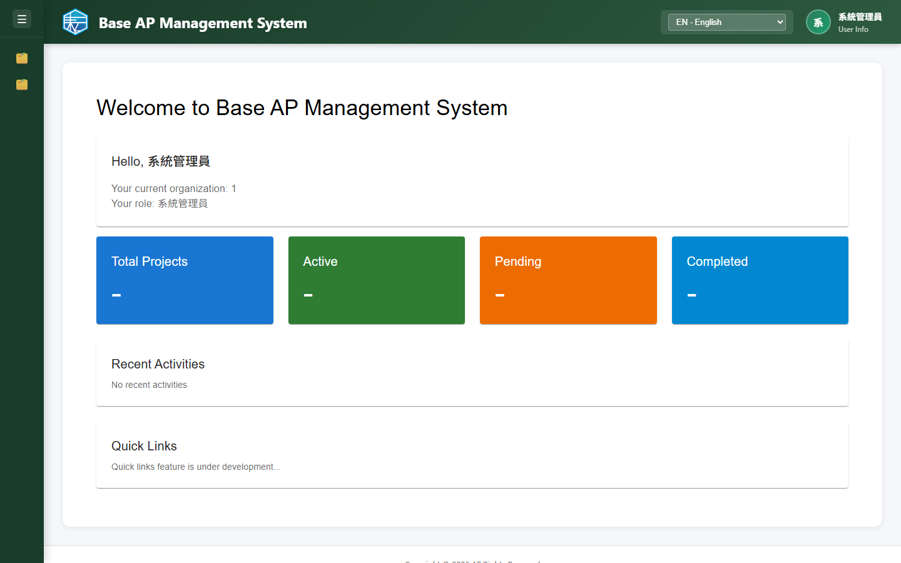

### 7.1 🌐 操作：切換語系

> 💡 **情境**：外籍同事想要把介面切換成英文。

**登入前切換：**

1. 🖱️ 在登入頁面右上角找到語系切換器
2. 🖱️ 點擊目標語系（如 `EN - English`）
3. ✅ 登入頁面立即切換為該語系

**登入後切換：**

1. 🖱️ 在上方標題列找到語系切換器（顯示目前語系如「繁中 - Traditional Chinese」）
2. 🖱️ 點擊切換為目標語系（如 `EN - English`）
3. ✅ 整個系統介面立即切換語系

語系切換器的顯示方式會依啟用語系數量自動調整：

- 🔘 **2 個語系**：顯示按鈕切換（如 `繁中 | EN`）
- 🔽 **3 個以上**：顯示下拉選單

### 7.2 🌐 多語系資料的操作方式

以下資料在新增/編輯時，會依啟用語系**自動顯示多個輸入欄位**：

| 資料表        | 多語系欄位             | 表單中的呈現                               |
| ------------- | ---------------------- | ------------------------------------------ |
| 👥 使用者角色 | 角色名稱               | 每個語系一個輸入框（如 zh-TW: __, en: __） |
| 📂 系統功能   | 功能名稱               | 同上                                       |
| ⚙️ 系統設定 | 系統標題、版權宣告     | 同上                                       |
| 🏷️ 系統代碼 | 代碼類型名稱、代碼名稱 | 同上                                       |
| 📢 系統通知   | 通知標題、通知內容     | 同上                                       |

> 💡 **不需手動補齊所有語系**：新增語系時，系統會以預設語系的值自動填補其他語系的空白欄位。

### 7.3 🔧 操作：管理啟用語系

> 💡 **情境**：公司準備拓展日本市場，需要新增日文介面。

1. 🖱️ 進入「⚙️ 系統設定資料」頁面（§5.1）
2. 📋 捲動到「語系設定」區塊
3. ☑️ 勾選要新啟用的語系（如 `ja`）
4. 🔤 在下方的系統標題/版權宣告中填入新語系的文字
5. 💾 點擊「**儲存**」
6. 🔄 （選用）點擊「**語系翻譯同步補足**」按鈕 — 系統會自動掃描所有翻譯檔案，將缺少的 key 以預設語系值補齊
7. ✅ 新語系在語系切換器中出現，所有多語系欄位的表單自動新增該語系的輸入框

---

## 8. 系統維護模式

> 💡 **情境**：系統需要升級資料庫，暫時關閉服務讓使用者看到維護中的提示頁面。

#### 🚧 操作：啟用維護模式

> 💡 **情境**：要進行資料庫升級，需要暫時關閉系統讓使用者看到「維護中」的友善提示。

**開啟維護模式：**

1. 🖱️ 進入「⚙️ 系統設定資料」頁面（§5.1）
2. ☐ **取消勾選**「系統服務狀態」checkbox
3. 💾 點擊「**儲存**」
4. 🚧 **立即生效** — 系統進入維護模式

**維護模式中的行為：**

| 對象          | 行為                                                           |
| ------------- | -------------------------------------------------------------- |
| 🔒 所有使用者 | 看到維護中頁面，無法登入或操作                                 |
| 🌐 維護頁面   | 顯示多語系的維護訊息                                           |
| 📧 聯絡方式   | 頁面上顯示系統管理員 Email（在系統設定中設定的「管理員信箱」） |
| 👤 已登入者   | 刷新頁面後也會看到維護中頁面                                   |

**解除維護模式：**

1. 🖱️ 重新進入系統設定頁面（管理員可透過直接存取後端 API 或資料庫操作）
2. ☑️ **重新勾選**「系統服務狀態」checkbox
3. 💾 點擊「**儲存**」
4. ✅ 系統立即恢復正常，使用者可重新登入

> ⚠️ **注意**：啟用維護模式前，請先確認：
>
> - 📢 已透過系統通知（§5.8）提前告知使用者維護時段
> - 💾 所有進行中的工作已儲存
> - 🔑 您知道如何恢復（避免把自己也鎖在外面）

---

## 附錄

### A. 🔐 權限對照說明

| 權限代碼 | 圖示 | 中文 | 說明                 |
| -------- | :--: | ---- | -------------------- |
| Create   |  ➕  | 新增 | 可建立新資料         |
| Read     | 👁️ | 讀取 | 可檢視資料清單與詳情 |
| Update   | ✏️ | 修改 | 可編輯既有資料       |
| Delete   | 🗑️ | 刪除 | 可刪除資料           |
| Print    | 🖨️ | 列印 | 可列印或匯出資料     |
| File     |  📎  | 檔案 | 可上傳或管理附件     |

### B. 👤 預設系統帳號

| 帳號      | 說明                   |
| --------- | ---------------------- |
| `admin` | 系統管理員（初始帳號） |

> ⚠️ **重要**：首次使用請務必透過「🔒 變更密碼」功能修改預設密碼。

### C. 🌐 瀏覽器支援

| 瀏覽器         |    支援    |
| -------------- | :--------: |
| Google Chrome  | ✅（建議） |
| Microsoft Edge |     ✅     |
| Firefox        |     ✅     |
| Safari         |     ✅     |

建議使用最新版本瀏覽器以獲得最佳體驗。

### D. ⌨️ 常用快捷操作

| 情境         | 操作                         |
| ------------ | ---------------------------- |
| 快速搜尋     | 在搜尋欄輸入關鍵字後按 Enter |
| 關閉彈出視窗 | 點擊視窗外的灰色遮罩區域     |
| 切換語系     | 點擊標題列的語系按鈕         |
| 回到首頁     | 點擊左上角系統 Logo          |
